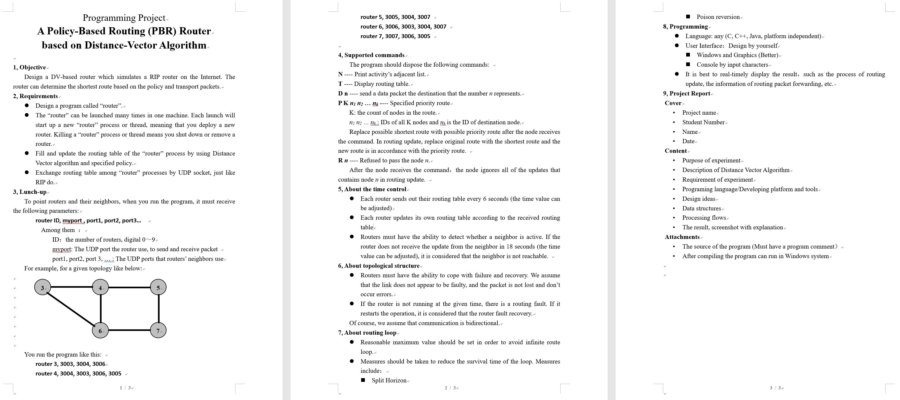

# RouterDV

感谢`ItsSoHardToIntitle`作者[CNLab5_IPlayer_DV](https://github.com/ItsSoHardToIntitle/CNLab5_IPlayer_DV)项目中的路由部分核心算法。

## 题目要求

## 使用说明

- git下载此项目
- 打开sln文件，使用VS编译运行
- 程序中先点击左上角的输入参数，然后在右侧按要求格式输入路由表，点击提交
- 更改参数的话，过程同上（但是没试过二次更改参数功能）
- 在"相邻路由"里选择可以展示相邻路由关系
- 选择"路由选择"和"发包向"之后点击"开始发包"，可以看出整个发包的过程
- 路由表展示了每一个路由去往目标路由的下一跳和距离

## TODO

- 其实是没有严格按照题目要求来的，但是不想写了（
- 目前设定的默认两路由器之间距离是5，优先的话将附近路由距离变成1，停用的话是16  
但是都写在了程序里，没有做自由调整
- 目前优先路由和停用路由之间不能同时选择
